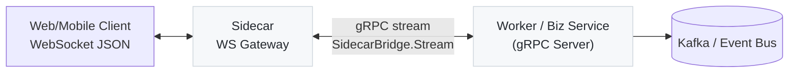

# transport-lib

Goden-Gun / GGA 系列服务的通用“通信协议 + 基础设施”库：在一个仓库里统一维护 Sidecar ↔ Worker 的 Protobuf 协议、生成代码，以及 Go 侧桥接/Envelope/Tracing/配置/鉴权/Kafka/日志等通用能力。

本仓库定位是 **library**（不提供可执行二进制），下游服务通过 `go get` 直接依赖。

## 你会用到的入口

- **协议定义（单一真相）**：`proto/bridge/v1/bridge.proto`
- **生成代码（已提交）**：`gen/go/...`（下游项目不需要安装 protoc 也能直接使用）
- **Go Helper**：
  - `pkg/bridge`：gRPC 双向流封装（注册/心跳/ACK/重连/Drain）
  - `pkg/envelope`：Envelope/Message 便捷别名 + Normalize/Validate/Trace/Slot helpers
  - `pkg/tracing`：OpenTelemetry TraceContext 注入/提取（gRPC metadata）
  - `pkg/codes`：统一错误码（numeric + string）
  - `pkg/config` + `pkg/bootstrap`：通用配置加载与基础设施初始化（logger/redis/tracing/kafka）
  - `pkg/auth`：JWT 签发/校验 + Redis refresh store / access blocklist
  - `pkg/kafka`：Sarama manager（自动注入 trace headers）
  - `pkg/logger`：logrus 薄封装（支持 `trace_id` 字段）

## 架构概览

> 协议视角：WebSocket 的 payload 与 gRPC stream 的 `TransportEnvelope` 同源，统一由 `bridge.proto` 定义。



### 角色与方向约定

- **Sidecar 作为 gRPC Client**：发起 `SidecarBridge.Stream`，发送 `Register/Ingress/Ack/Heartbeat`，接收 `Deliver/Broadcast/Heartbeat`。
- **Worker 作为 gRPC Server**：实现 `SidecarBridge` 服务，处理 Sidecar 入站帧，并向 Sidecar 推送 Deliver/Broadcast。

## 目录结构

```
transport-lib/
├── proto/                       # Protobuf（协议单一真相）
│   └── bridge/v1/bridge.proto   # SidecarBridge 双向流 + Envelope/Message 定义
├── gen/                         # 生成代码（已提交）
│   └── go/bridge/v1/            # go_package: .../gen/go/bridge/v1;bridgepb
├── pkg/                         # Go 侧通用能力（可按需引用）
│   ├── bridge/                  # gRPC stream client/server + Delivery(Ack)
│   ├── envelope/                # Envelope/Message helpers（Normalize/Validate/Trace/Slot）
│   ├── tracing/                 # OTel TraceContext 注入/提取（gRPC metadata）
│   ├── codes/                   # 统一错误码 registry
│   ├── config/                  # viper 配置加载、基础 config types
│   ├── bootstrap/               # logger/redis/tracing/kafka 初始化
│   ├── auth/                    # JWT + Redis store/blocklist 抽象
│   ├── kafka/                   # Sarama manager（trace headers）
│   └── logger/                  # logrus wrapper（WithTrace）
├── schema/                      # JSON Schema（前端/网关校验用）
├── docs/                        # 设计说明与约定
├── scripts/generate.sh          # protoc 生成脚本
└── .github/workflows/           # CI：proto 变更 → 自动 regen → push 回分支
```

## 协议设计（bridge/v1）

### Stream 帧类型

**Sidecar → Worker（StreamRequest）**

- `RegisterFrame`：注册节点（node_id/namespace/version capabilities）
- `IngressFrame`：客户端入站消息（WS → Sidecar → Worker）
- `AckFrame`：对 Deliver/Broadcast 的确认（Sidecar 回执）
- `HeartbeatFrame`：心跳（保活 + 探测链路）

**Worker → Sidecar（StreamResponse）**

- `DeliverFrame`：点对点投递（指定 connection/user）
- `BroadcastFrame`：广播/组播投递（含 broadcast_id）
- `HeartbeatFrame`：心跳响应

### TransportEnvelope（路由 + 元数据）

`TransportEnvelope` 是“传输信封”，把 **路由信息** 和 **业务消息** 统一封装：

- **连接/身份**：`connection_id`, `user_id`
- **节点/租户隔离**：`node_id`, `namespace`
- **路由目标**：`target_connection_ids`, `target_user_ids`
- **可观测性**：`trace_id` + `attributes["trace_id"]`（建议保持一致）
- **版本**：`envelope_version`（默认 `2025-01`，见 `pkg/envelope.Version`）
- **Slot 路由**：`slot_id`, `slot_generation`（一致性路由/分片场景）
- **业务体**：`message`

### Message（业务语义）

`Message` 表达“业务语义”，推荐约定：

- `version`：消息版本（默认 `2025-01`）
- `kind`：建议值：`request` / `event` / `response` / `system`
- `action`：业务动作（例如 `chat.send`、`rtc.join`）
- `request_id`：幂等/链路关联 ID（缺省会在 `pkg/envelope.NormalizeMessage` 中生成）
- `payload`：`text` / `audio` 二选一（或都为空视为非法 ingress）
- `metadata`：轻量元数据（例如 device/app 信息）
- `timestamp`：事件时间戳
- `error`：统一错误体（见下一节）
- `extras`：扩展字段（结构化）

### 错误模型（ErrorPayload）

错误统一采用 **numeric + string** 双编码：

```protobuf
message ErrorPayload {
  int32 code = 1;          // 数值错误码（40101-503xx）
  string error_code = 2;   // 字符串错误码（如 TOKEN_INVALID）
  string message = 3;      // 用户可读错误信息
  string details = 4;      // 可选详细信息
}
```

错误码段位建议（可按项目扩展）：

- `401xx` 认证错误、`403xx` 权限错误、`410xx` 请求格式错误、`429xx` 限流、`500xx` 服务端错误
- Go 侧可直接复用 `pkg/codes` 的静态 registry（统一文案/码值）

### WebSocket ↔ Protobuf 映射 & JSON Schema

- WebSocket payload 与 `bridge.proto` 同源（按 proto JSON Mapping 序列化）
- 对照文档：`docs/WS_PROTO_MAPPING.md`
- 前端校验：`schema/transport-envelope.json`

## Go 包说明（按需引用）

| 包 | 用途 | 常用 API / 约定 |
| --- | --- | --- |
| `gen/go/bridge/v1` | protobuf + gRPC 生成代码 | `bridgepb.SidecarBridgeClient/Server` |
| `pkg/envelope` | Envelope/Message helpers | `NormalizeMessage`, `ValidateIngress`, `NormalizeEnvelope`, `StampTrace`, `SetSlot` |
| `pkg/bridge` | gRPC stream 封装 | `NewClient`, `NewServer`, `Delivery.Ack`, `BroadcastDelivery.Ack` |
| `pkg/tracing` | OTel 透传 | `InjectMetadata`, `ExtractMetadata` |
| `pkg/codes` | 统一错误码 | `codes.Registry` |
| `pkg/config` | 配置加载 | `LoadConfig`, `GetEnv`, `GetNodeID` |
| `pkg/bootstrap` | 基础设施初始化 | `InitLogger*`, `InitRedis`, `InitTracing`, `InitKafka` |
| `pkg/auth` | JWT + Redis store 抽象 | `GenerateTokenPair*`, `VerifyAccessToken*`, `ConsumeRefreshToken` |
| `pkg/kafka` | Kafka 管理 | `NewManager`, `Manager.Publish`, `Manager.NewConsumerGroup*` |
| `pkg/logger` | logrus wrapper | `logger.WithTrace(ctx)` |

## 快速开始（Go）

### 安装

```bash
go get github.com/Goden-Gun/transport-lib@latest
```

### 直接使用 proto 生成类型

```go
import bridgepb "github.com/Goden-Gun/transport-lib/gen/go/bridge/v1"
```

### Sidecar（gRPC Client）示例：接入 Worker 并消费投递

```go
import (
	"context"

	"github.com/Goden-Gun/transport-lib/pkg/bridge"
)

func runSidecar(ctx context.Context) error {
	c, err := bridge.NewClient(bridge.Options{
		Address:   "worker:50051",
		NodeID:    "sidecar-001",
		Namespace: "prod",
		Insecure:  true,
	})
	if err != nil {
		return err
	}
	if err := c.Start(ctx); err != nil {
		return err
	}

	deliverCh, _ := c.SubscribeDeliver(ctx)
	go func() {
		for d := range deliverCh {
			// TODO: deliver to WebSocket client
			_ = d.Ack(ctx)
		}
	}()

	return nil
}
```

### Worker（gRPC Server）示例：处理 Ingress 并主动 Deliver

```go
import (
	"context"

	"github.com/Goden-Gun/transport-lib/pkg/bridge"
	"github.com/Goden-Gun/transport-lib/pkg/envelope"
)

type handler struct{}

func (h *handler) OnRegister(ctx context.Context, s bridge.Session, meta bridge.RegisterMeta) error { return nil }
func (h *handler) OnIngress(ctx context.Context, s bridge.Session, env envelope.TransportEnvelope) error {
	// TODO: handle ingress, then deliver response
	return s.SendDeliver(ctx, envelope.TransportEnvelope{Message: &envelope.Message{Action: "system.pong"}})
}
func (h *handler) OnAck(ctx context.Context, s bridge.Session, ack bridge.Ack) error      { return nil }
func (h *handler) OnHeartbeat(ctx context.Context, s bridge.Session, nonce string) error { return s.SendHeartbeat(ctx, nonce) }
func (h *handler) OnClose(ctx context.Context, s bridge.Session) error                   { return nil }

func runWorker(ctx context.Context) error {
	srv, err := bridge.NewServer(bridge.Options{Address: ":50051", Insecure: true})
	if err != nil {
		return err
	}
	return srv.Serve(ctx, &handler{})
}
```

## Protobuf 代码生成

> 下游项目一般不需要生成（`gen/` 已提交）。只有在修改 proto 时才需要。

### 本地生成

```bash
./scripts/generate.sh
```

脚本会：

- 检查 `protoc` 与 go 插件（`protoc-gen-go`, `protoc-gen-go-grpc`）
- 清理旧文件并生成到 `gen/go/`

### 工具要求

- Go：`go.mod` 中声明的版本（当前为 `1.25.3`）
- Protobuf 编译器：建议与 CI 对齐（workflow 中使用 `25.x`）

## CI：proto 变更自动回写 `gen/`

工作流：`.github/workflows/generate-proto.yml`

- **触发**：`main/develop` 分支的 `proto/**/*.proto` 变更、PR、手动触发
- **行为**：运行 `scripts/generate.sh` → 若 `gen/` 有变化则 commit 并 push 回当前分支
- **避免循环触发**：该 workflow 只监听 `proto/**/*.proto`，因此“回写 gen 的提交”不会再次触发生成

### Push 权限要求（重要）

如果你看到 `remote: Permission ... denied to github-actions[bot] (403)`：

1. 仓库设置 `Settings -> Actions -> General -> Workflow permissions` 需允许 **Read and write**
2. 若组织策略/分支保护限制了 `GITHUB_TOKEN`，可添加仓库 Secret：`PUSH_TOKEN`（fine-grained PAT，`Contents: Read and write`），workflow 会优先使用它

## 协议变更流程（推荐）

1. 修改 `proto/bridge/v1/bridge.proto`
2. 本地运行 `./scripts/generate.sh`（或依赖 CI 自动回写）
3. 提交 proto（以及生成代码，如 CI 没有自动回写的话）

## 协议演进与向后兼容

✅ 允许：

- 新增消息/字段（使用新的 field number）
- 新增枚举值/服务方法

❌ 避免：

- 删除/重命名字段、复用 field number
- 修改字段类型/语义导致兼容性破坏

## 相关文档

- `docs/WS_PROTO_MAPPING.md`：WebSocket ↔ Protobuf 映射与约定
- `docs/tracing_notes.md`：Trace 透传落地建议（OTel）
- `schema/transport-envelope.json`：JSON Schema（前端校验）
- `docs/ROADMAP.md`：Roadmap

## 许可证

当前仓库未提供 `LICENSE`（默认不具备开源许可）。如需开源分发，请补充许可证文件并更新本节。

## 维护者

- Goden-Gun / GGA Team
